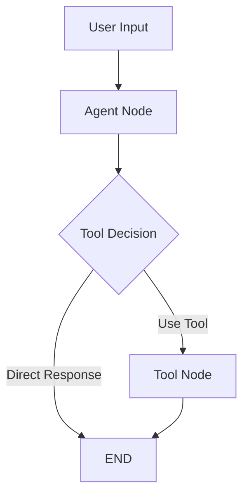

# LangChain + LangGraph + MCP + Agent Demo

A comprehensive demo project showcasing the integration of LangChain, LangGraph, MCP (Model Context Protocol), and AI agents using Moonshot AI's API.

## 🚀 Features

- **LangChain Integration**: Uses LangChain's MoonshotChat wrapper
- **LangGraph Workflows**: Sophisticated agent state management and conversation flows
- **MCP Server**: Model Context Protocol implementation for tool integration
- **Multi-tool Agent**: File operations, calculations, web search, and more
- **Conversation Memory**: Persistent chat history with thread management
- **Async Support**: Full asyncio implementation for better performance

## 📁 Project Structure

```
demo_chatbot/
├── src/
│   └── demo_chatbot/
│       ├── __init__.py
│       ├── cli.py                 # CLI interface
│       ├── examples.py            # Comprehensive examples
│       ├── agents/
│       │   ├── __init__.py
│       │   └── langgraph_agent.py # LangGraph agent
│       ├── servers/
│       │   ├── __init__.py
│       │   └── mcp_server.py      # MCP server implementation
│       ├── tools/
│       │   └── __init__.py        # Tool definitions
│       ├── config/
│       │   ├── __init__.py
│       │   └── settings.py        # Configuration management
│       └── utils/
│           ├── __init__.py
│           └── logger.py          # Logging utilities
├── tests/                          # Test suite
├── scripts/                        # Windows setup scripts
├── venv/                           # Virtual environment
├── logs/                           # Log files
├── data/                           # Application data
├── .env                            # Environment variables
├── pyproject.toml                  # Modern Python packaging
└── README.md                       # Documentation
```

## 🛠️ Installation

### 🪟 Windows (Recommended)

1. **Automatic setup**:
   ```cmd
   # Command Prompt
   scripts\setup.bat
   
   # PowerShell
   .\scripts\setup.ps1
   ```

2. **Windows commands**:
   ```cmd
   scripts\run.bat check        # Check environment
   scripts\run.bat demo         # Run demo
   scripts\run.bat interactive  # Interactive mode
   scripts\run.bat examples     # Run all examples
   scripts\run.bat chat         # Chat with memory
   scripts\run.bat install      # Install dependencies
   scripts\run.bat test         # Run tests
   scripts\run.bat lint         # Run linting
   ```

### 🐧 Linux/macOS

1. **Set up environment**:
   ```bash
   # Copy and edit .env file
   cp .env.example .env
   # Add your MOONSHOT_API_KEY to .env
   
   # Run setup script
   ./scripts/setup.sh
   ```

2. **Install dependencies**:
   ```bash
   pip install -e .
   ```

3. **Verify setup**:
   ```bash
   python -m demo_chatbot.cli check
   ```

4. **Run demo**:
   ```bash
   python -m demo_chatbot.cli demo
   ```

5. **Interactive chat**:
   ```bash
   python -m demo_chatbot.cli interactive
   ```

## 🎯 Usage

### CLI Commands

```bash
# Direct Python commands
python -m demo_chatbot.cli check          # Check environment setup
python -m demo_chatbot.cli demo           # Run agent demo
python -m demo_chatbot.cli interactive    # Start interactive chat
python -m demo_chatbot.cli examples       # Run comprehensive examples
python -m demo_chatbot.cli chat --thread-id my_session
```

### 🪟 Windows-Specific Features

- **PowerShell Integration**: Use `.\scripts\setup.ps1` for PowerShell
- **Command Prompt**: Use `scripts\setup.bat` for CMD
- **Windows Terminal**: Optimized for Windows Terminal
- **Path Handling**: Automatic Windows path separator handling
- **Proxy Support**: Built-in support for corporate networks

## 🔧 Configuration

### Environment Variables (.env file)
```ini
# Required
MOONSHOT_API_KEY=your_moonshot_api_key_here

# Optional - Windows paths
WORKING_DIRECTORY=C:\Users\YourName\Projects\demo_chatbot
LOG_FILE=logs\chatbot.log

# Proxy settings (for corporate networks)
HTTP_PROXY=http://proxy.company.com:8080
HTTPS_PROXY=https://proxy.company.com:8080
```

## 🎯 Tools Available

The agent has access to these tools:

- **File Operations**: Read, write, and list files/directories
- **Calculator**: Evaluate mathematical expressions
- **Web Search**: Mock web search functionality
- **Directory Listing**: Browse file system contents
- **System Info**: Get system information (Windows compatible)

## 🧪 Testing

```bash
# Run all tests
python -m pytest tests/ -v

# Run specific test file
python -m pytest tests/test_agents.py -v

# Run with coverage
python -m pytest tests/ --cov=demo_chatbot --cov-report=html
```

## 🏗️ Architecture

### LangGraph Workflow



## 📖 Examples

### Basic Usage

```python
import asyncio
from demo_chatbot.agents.langgraph_agent import LangGraphAgent

async def main():
    agent = LangGraphAgent()
    response = await agent.run("Hello! Can you help me?")
    print(response)

asyncio.run(main())
```

### File Operations

```python
# Create a file
await agent.run("Create a file called 'notes.txt' with 'Hello World'")

# Read the file
content = await agent.run("Read the contents of notes.txt")
```

### Conversation Memory

```python
# Thread-based conversation memory
await agent.run("My name is Alice", thread_id="user123")
await agent.run("What's my name?", thread_id="user123")  # Remembers Alice
```

## 🆘 Troubleshooting

### Windows-Specific Issues

**Python not found**:
```cmd
# Check Python installation
python --version
where python

# Use full path if needed
C:\Python39\python.exe -m venv venv
```

**PowerShell execution policy**:
```powershell
# Run as Administrator if needed
Set-ExecutionPolicy -ExecutionPolicy RemoteSigned -Scope CurrentUser
```

**Virtual environment issues**:
```cmd
# Manual activation
venv\Scripts\activate.bat
```

## 🔍 Performance Tips

- **Use SSD storage** for better file I/O performance
- **Exclude venv from antivirus scans** to improve speed
- **Use Windows Terminal** instead of Command Prompt
- **Enable long path support** if needed

## 📊 Development Workflow

1. **Set up development environment**:
   ```cmd
   scripts\setup.bat
   ```

2. **Run tests**:
   ```cmd
   scripts\run.bat test
   ```

3. **Check code quality**:
   ```cmd
   scripts\run.bat lint
   ```

4. **Start development**:
   ```cmd
   scripts\run.bat interactive
   ```

## 🤝 Contributing

Feel free to extend this demo with:
- Additional tools
- Real MCP server implementation
- Web interface
- Database integration
- Advanced agent behaviors

## 📄 License

This is a demo project for educational purposes.